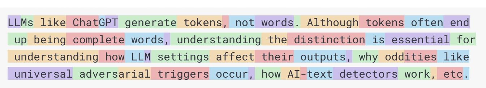

# Spring AI Quick Reference

## AI Fundamentals

**AI:** Computer systems that perform human-like tasks  
**ML:** AI that learns from data without explicit programming  
**LLMs:** AI models trained on text to understand and generate language  
**Tokens:** Text units that models process (words/word parts)  

**Context:** Information the model uses to generate responses  
**Context Window:** Maximum text length a model can process at once  
**Prompt:** Input instruction given to the AI model  
**Temperature:** Controls randomness (0=focused, 1=creative)  
**Embeddings:** Numerical representations of text meaning  
**Vector Database:** Storage for embeddings with similarity search

## Spring AI

Framework that integrates AI into Spring applications using familiar patterns:
- **ChatClient:** Handle LLM conversations
- **EmbeddingClient:** Convert text to vectors
- **VectorStore:** Store and search embeddings

## Azure OpenAI

Microsoft's enterprise AI service providing OpenAI models with:
- Enterprise security and compliance
- Scalable cloud infrastructure
- Models: GPT-4, GPT-3.5, embeddings

## RAG (Retrieval-Augmented Generation)

Process: Search documents → Include in prompt → Generate informed response
- Gives AI access to external knowledge beyond training data
- Improves accuracy with current information

## ETL for AI

**Extract:** Get data from sources (PDFs, databases, web)  
**Transform:** Clean and chunk text for AI processing  
**Load:** Store in vector databases for retrieval

## Ollama

Platform for running AI models locally:
- Privacy: Data stays on your machine
- Cost: No API charges
- Models: Llama, Mistral, CodeLlama

## In-Memory Chat Repository

Stores conversation history in application memory:
- Maintains context across messages
- Fast access to chat history
- Session-based conversation management