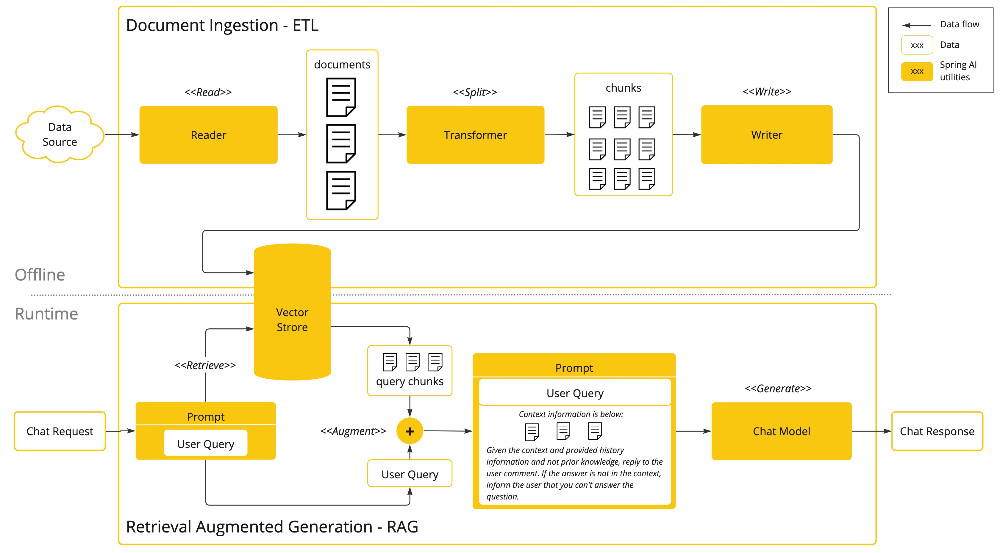

# Spring AI Quick Reference

## AI Fundamentals
**AI:** Computer systems that perform human-like tasks  
**ML:** AI that learns from data without explicit programming  
**Models:** AI algorithms that process and generate information, mimicking human-like functions.
**LLMs:** AI models trained on text to understand and generate language  
**Tokens:** Text units that models process (words/word parts)  

**Context:** Information the model uses to generate responses  
**Context Window:** Maximum text length a model can process at once  
**Prompt:** Input instruction given to the AI model
- System Prompt - instructions/guidelines for the model to generate a response 
- User Prompt - user's input to the model

**Prompt Templates:** Predefined prompts that can be used to generate responses  
**Structured Output:** AI models output in form os as string by default. There are customizations to make the output a structured object.  
**Embeddings:** Numerical representations of text, images, or videos meaning. Embeddings are float vectors that can be used for similarity or semantic search.   
**Vector Database:** Storage for embeddings with similarity search  
**Temperature:** Controls randomness (0=focused, 1=creative)

## Spring AI
Framework that integrates AI into Spring applications using familiar patterns:
- **ChatClient:** Handle LLM conversations
- **EmbeddingClient:** Convert text to vectors
- **VectorStore:** Store and search embeddings

It currently supports models that process various inputs and outputs:
- language
- image
- audio
## Bringing your Data & APIs to the AI Model
Suppose to ask a model a question beyond the context it was trained on, the model will definitely say that it does not know.
There are three techniques to make the model aware of the context:
- **Fine Tuning:** Train the model on a new Dataset. This is a challenging task and requires lots of resources. Some models may also not provide this option.
- **Prompt Stuffing:** Add context to the prompt. This is a simple and effective technique. You may call it Retrieval-Augmented Generation (RAG).
- **Tool Calling:** Involves connecting the model to an external tool or APIs. The tools are user-defined services

## RAG (Retrieval-Augmented Generation)
Process: Search documents → Include in prompt → Generate informed response
- Gives AI access to external knowledge beyond training data
- Improves accuracy with current information
RAG basically implements the `ETL` pipeline.
## ETL

**Extract:** Get data from sources (PDFs, databases, web)  
**Transform:** Clean and chunk text for AI processing  
**Load:** Store in vector databases for retrieval
## Tool Calling
Allows AI to call external tools or APIs to generate responses.
In Spring AI, you can define a tool, annotate the method with `@Tool` and call it from a prompt.
Tools consist of: name, description and the schema of the input params
## Evaluating AI Responses
- **Accuracy:** How well the model answers the question
- **Relevance:** How relevant the response is to the question
- **Fidelity:** How well the response matches the user's input
- **Completeness:** How much of the user's input is covered by the response
- **Coherence:** How well the response is coherent
- **Consistency:** How consistent the response is across different users
- **Efficiency:** How fast the response is generated
- **Ease of Use:** How easy it is to use the response
- **Trustworthiness:** How trustworthy the response is
Spring AI provides an `Evaluator` class to evaluate responses.

## Azure OpenAI
Microsoft's enterprise AI service providing OpenAI models with:
- Enterprise security and compliance
- Scalable cloud infrastructure
- Models: GPT-4, GPT-3.5, embeddings

## Ollama
Platform for running AI models locally:
- Privacy: Data stays on your machine
- Cost: No API charges
- Models: Llama, Mistral, CodeLlama

## In-Memory Chat Repository
Stores conversation history in application memory:
- Maintains context across messages
- Fast access to chat history
- Session-based conversation management